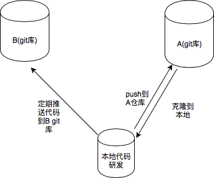

# 如何进行进行多远程仓库管理

该功能主要是在不同网络环境、不同仓库、不同gitlab 类型的仓库的代码管理。俗称多远程仓库管理。



## 距离
线上主仓的代码，为一个官方对外仓库 一般情况下无权对这个仓库进行直接的处理和修改，然后我们会fork 这个仓库进行代码管理，并且会做内外网的代码同步处理。在本地开发的时候可能需要管理多个远程仓库的代码逻辑
并进行代码审查和构建测试验证。
`https://github.com/tencentyun/iotexplorer-h5-panel-demo.git`


## 操作方法

通过添加新远程仓库分支
git remote add teen https://github.com/noonhorse/iotexplorer-h5-panel-demo.git

查看可以看到仓库代码

`git remote -v`

```
origin  https://github.com/tencentyun/iotexplorer-h5-panel-demo.git (fetch)
origin  https://github.com/tencentyun/iotexplorer-h5-panel-demo.git (push)
teen  https://github.com/noonhorse/iotexplorer-h5-panel-demo.git (fetch)
teen  https://github.com/noonhorse/iotexplorer-h5-panel-demo.git (push)
```

切换到不同远程仓库的本地分支
`git switch - teen/master`

也可以通过 `git switch -c <new-branch-name>` 来创建新分支

切换分支后可以通过 `git branch`来查看当前分支

修改后提交代码, push 需要指明分支

```
git commit -am 'docs: 本地提交更新'
git push teen
```


## 代码合并的两种方式

1、本地合并
通过拉取不同网络环境、不同域名的仓库。通过本地merge 来合并代码，解决冲突后，再push 到不同代码仓库中。
远端一般处理同一个仓库下，分支与主干的Merge request


2、远程合并
远程代码合并，是对两个仓库发起 `pull request` 的方式来合并多仓库的代码 ，主要在github 中使用。
如果代码有冲突，可以通过 方法1 在本地解决冲突后，再提 PR 

## 分支推送方式

### 一：添加多个远程仓库, 分别推送

优点是每个分支可以独立管理，

```
git remote add git <url1>
git remote add github <url2>

git remote -v

git push -u git master
git push -u github master
```

### 二：当前仓库追加远程地址，一次推送

优点是：一份代码多地同步

```
git remote add github <url1>
git remote set-url --add github <url2>

git remote -v

git push
```