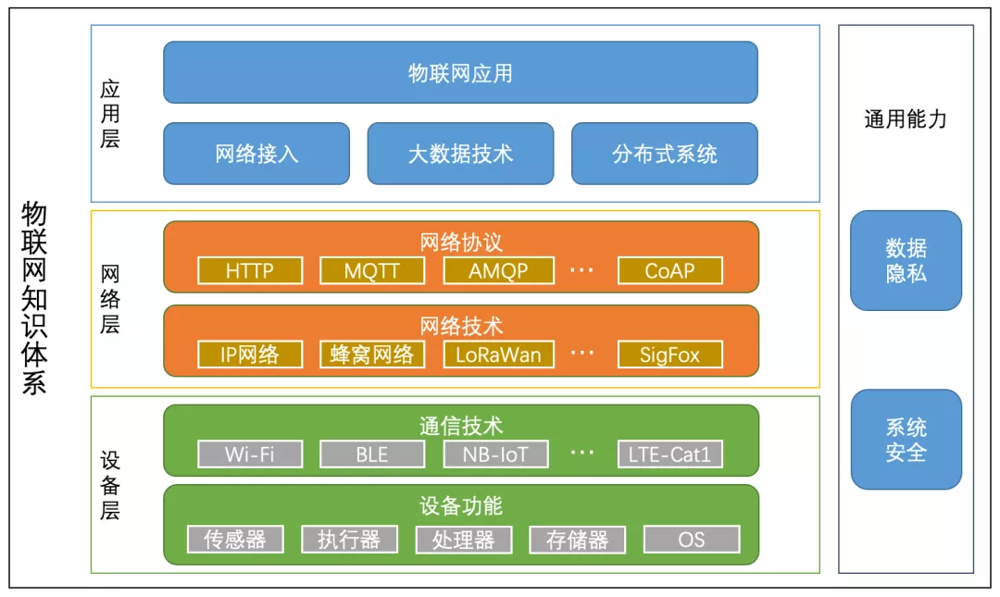

IoT知识图谱

*IoT简单分层架构图*

# 计算机网络

设备会透过节点之间的连接（数据链路）互相交换数据。

https://zh.wikipedia.org/wiki/%E8%AE%A1%E7%AE%97%E6%9C%BA%E7%BD%91%E7%BB%9C#%E5%88%86%E7%B1%BB

## 网络

### 有线网络
model、双绞线、光纤

### 无线网络

2/3/4G、5G、NB-IoT、LoRa

### 协议

- MQTT
- TLS
- DTLS
- LoRaWAN
- [NB-IoT](2022/01/nb-iot.md)
- OneM2M
- [LWM2M](2022/01/lwm2m.md)

# 操作系统

# 软件

[自定义全局变量设置](2022/01/global-shell-set.md)