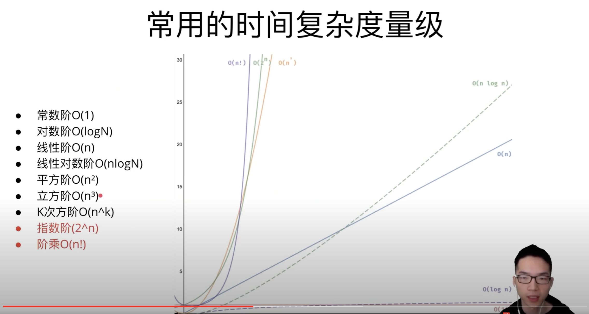
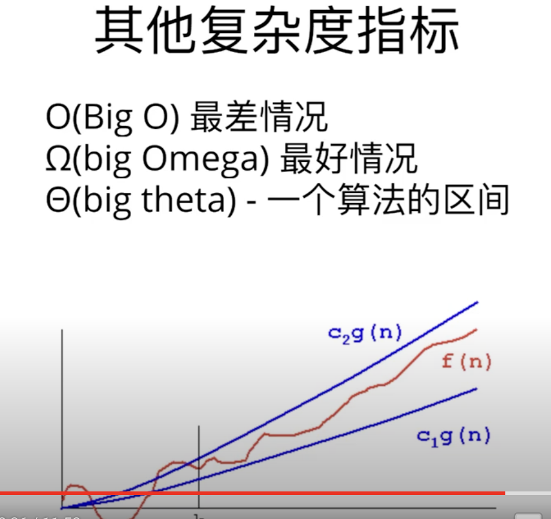

## 数据结构与算法
数据结构是计算机存储、组织组织数据的方式
程序 = 数据结构 + 算法


## 数学

## 数组

|array[]-> value| 15 | 40 | 55 | 32 | 65 | 21 | 77 | 
|:--|:--|:--|:--|:--|:--|:--|:--|
|array[]-> index|0|1|2|3|4|5|6｜

Array lenght: 7; Array First index: 0 , value: 15;

## 字符串

## 链表

## 队列

## 栈

## 堆

## 哈希

## 二叉树


## 复杂度
### 1、时间复杂度
算法的渐进时间复杂度 `T(n) = O(f(n))`

```js
// eg1
for(let i =0; i<n; i++) { x++; }
// O(1 + 3N) = O(N) , 当N 无限大时，可以简化成O(N)
// 执行逻辑上面，i=0 执行1次; i<n 执行n次;i++ 执行n次 ,x++ 执行n次

// eg2
for(let i =0; i<n; i++) { 
    for(let k = 0; k< n; k++) {
        x++;
    }
 }
 // O(n * n) = O(n^2)

//eg3 => eg1 + eg2 组合并行
// O(n + n^2) = O(n^2)

```


### 2、空间复杂度

### 3、复杂度量级分析



### O(1)示例

`int i =2; int b = 5 + i;`

### O(n)

`for(let i =0; i<n; i++) { x++; }`


### O(logN)

```js
int i =1;
while(i<n) { i = i*2; }
```

### O(nlogN)
```js
for(let i =0; i<n; i++) { x++; 
    int x =1;
    while(x<n) { x = x*2; }
}
```

### O(n^2)
```js
for(let i =0; i<n; i++) { 
    for(let k = 0; k< n; k++) {
        x++;
    }
 }
 // 如果内层循环n =m, 则表示为 O(nm)
```
### 其他区间

