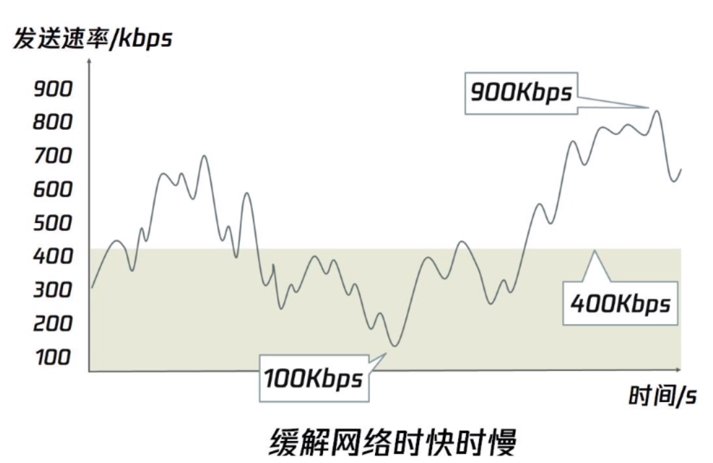
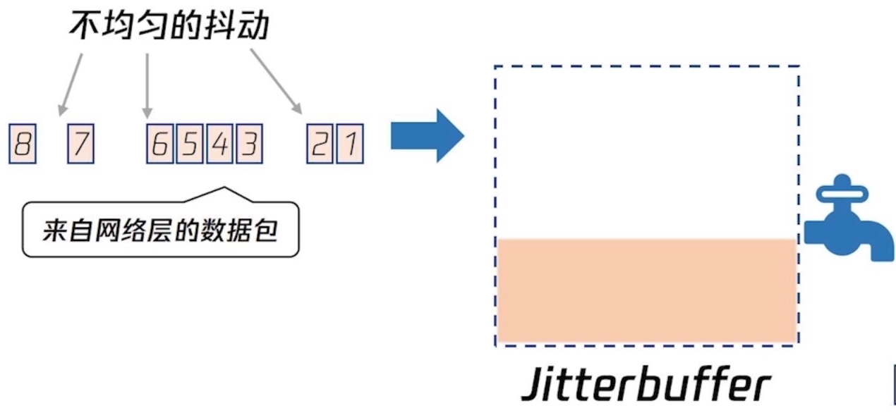

# 音视频相关的基础信息

## 视频

### 基本参数

分辨率
帧率
码率

### **视频帧**

**常见的帧**：
IDR即时解码刷新帧，收到时解码器马上刷新GOP开始解码。

I帧：即关键帧。记录了一幅完整的画面，可以被直接解码显示。

P帧：即向前预测帧。不记录画面。

B帧：即算共享预测帧。记录本帧与前一帧、后一帧的差异。

**视频的层次结构**

## 音频

### 基本参数

采样率
声道数
位宽

**音频帧**

音频帧是把一定数量的连续采样点组合到一起组成一个音频帧。
如：AAC通常为1024个采样点，48KHz的采样率下帧的时长为21.3ms。
最多48个全频带的声道，16个 120Hz的低频声道，16个耦合声道，96kHz采样率，320kbps的码率。
AAC编码格式包含：
ADTS：Audio Data Transport Stream 音频数据传输流。特征是有Sync Word 的码流。解码可以在音频流红任何位置开始。
ADIF: Audio Data Interchange Format 音频数据交换格式，特征是解码时必须从指定头部位置开始。

## 格式与协议

### 原数据格式
YUV、RGB、PCM(音频)

### 编码格式
[H.264(AVC)](./h264)、H.265/HEVC、H.266/VVC
[AAC](./aac)、Opus

### 封装格式

### 传输协议
RTMP、HLS、RTP、HTTP-FLV

HLS（HTTP Live Stream）是苹果公司基于HTTP提出的流媒体协议，
RTP（Realtime Transport Protocol）实时传输协议，是传输音视频的标准数据包格式。用于流媒体、视频会议、IP电话等。
RTCP（RTP Control Protocol）配合RTP进行信道控制、数据统计、Qos等

## 优化策略

由于在网络环境下对视频流的推送、拉取上，丢包率、延时(RTT)、带宽(速率 bps )、网络抖动等情况会影响。

**Jitterbuffer 机制**

网络抖动无法避免，提升平稳性，在编解码器和网络协议栈之间提供一个缓冲区。抹平网络时快时慢的波动问题。

 
拉流平衡收发数据的稳定性

